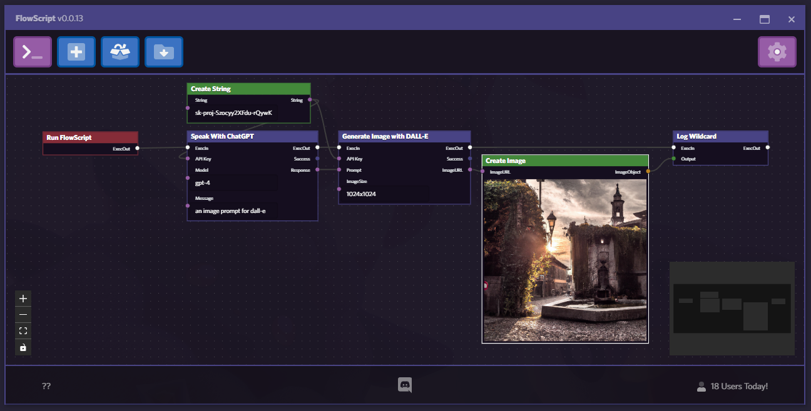

    
    

        
        
        
    

### What is FlowScript
FlowScript is a node based visual scripting system powered by JavaScript. With a modern interface that allows you to edit FlowScript node graphs, writing simple javascript applications has never been easier! 

| :exclamation: THIS APP IS IN BETA!! PLEASE REPORT ANY BUGS! |
|---|

### Download Link & Install Guides
- [Download Latest Release](./releases)
- [How to Install App](./resources/readme/install.md)
- [Developer Build](./resources/readme/install-dev.md)

### FlowScript Features
- Painless Installation 
- Easily Navigatible Modern UI 
- Automatic App Updates (FlowScript Editor will always be the latest version)
- Customizable Theme + Multiple Defaults 
- Optional Minimize to System Tray
- Optional Auto Minimize App on Launch
- Optional Auto Launch App on System Boot
- [TO-DO] Multi Platform Support (win+linux)
- [TO-DO] System Notifications

### Requirements
- Windows PC (for release version, linux/mac can use developer build directly with node.js installed)

### Technical Details
- [Nextron](https://github.com/saltyshiomix/nextron) (Bundles Next with Electron)
    - [Electron](https://www.electronjs.org/)
    - [Next.js](https://nextjs.org/)
    - [React](https://react.dev/)

